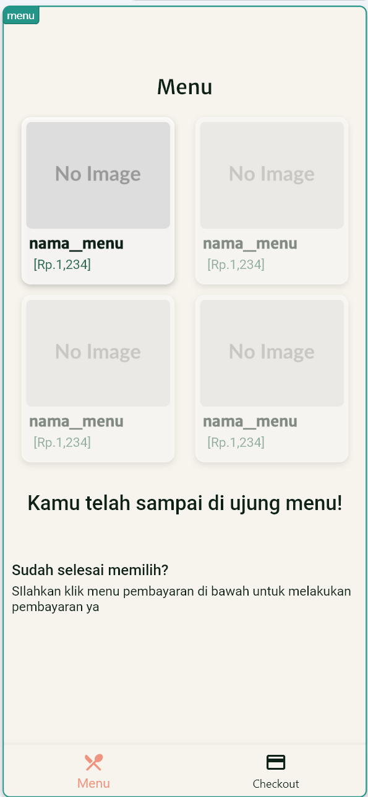
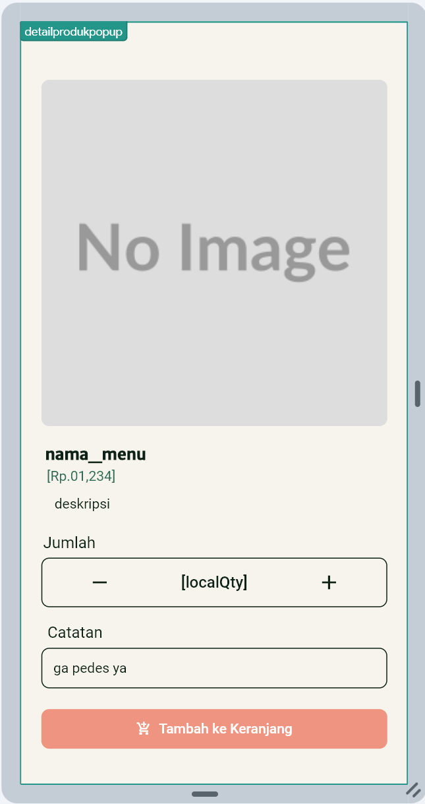
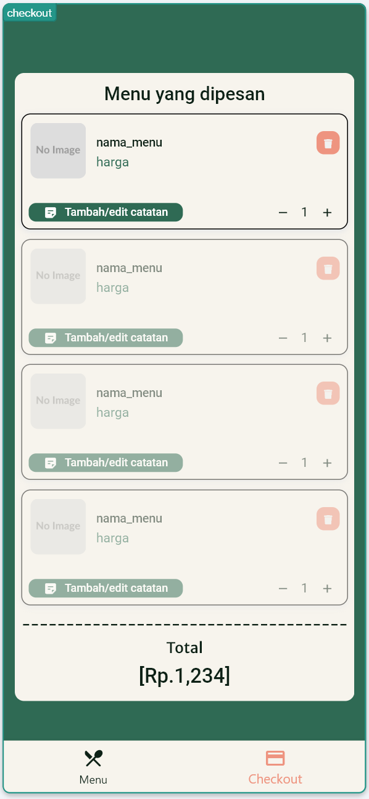

# 📱 Aril's House - Digital Ordering System

> A modern, digital ordering solution designed to streamline operations for **Aril's House**, a local culinary MSME (UMKM) serving authentic home cooking since 2014.

---

## 📋 Project Overview

This application modernizes the dine-in experience by replacing traditional paper menus. It allows customers to identify themselves, select their table number, browse the complete menu digitally, add special instructions to their orders, and review their cart before finalizing the purchase.

Developed using **FlutterFlow**, utilizing a low-code approach to deliver a robust and user-friendly interface efficiently.

### 🎯 Key Objectives
* **Digitize Operations:** Move away from manual order taking.
* **Enhance Accuracy:** Reduce errors by allowing customers to input specific notes directly.
* **Improve Experience:** Provide a clean, modern interface for browsing menus.

---

## 📸 Application Screenshots

A walkthrough of the user journey, from seating to ordering.

| 1. Welcome & Onboarding | 2. Interactive Menu |
| :---: | :---: |
|  |  |
| *Customer inputs name and selects table number.* | *Clear view of available dishes and prices.* |

| 3. Item Detail & Custom Notes | 4. Smart Cart & Checkout |
| :---: | :---: |
|  |  |
| *Add items and specify special requests (e.g., "Not spicy").* | *Review order, adjust quantities, or edit notes before finalizing.* |

---

## ✨ Key Features

### 👤 Seamless Customer Onboarding
Simple entry screen capturing essential details: Customer Name and Table Number to ensure orders are delivered correctly.

### 🍽️ Dynamic Digital Menu
An easy-to-navigate grid layout showcasing menu items with clear pricing.

### 📝 Robust Customization (Special Requests)
This is a crucial feature for food orders. Customers can add specific notes to **each individual item** (e.g., "Less sugar," "Extra sauce") directly via a pop-up or a dedicated bottom sheet note editor.

### 🛒 Smart Cart Management
A comprehensive checkout screen where users can:
* View a summary of all selected items.
* Increase or decrease item quantities dynamically.
* Remove items from the cart.
* View the real-time Total Price.

---

## 🛠️ Tech Stack

This project demonstrates the power of modern **Low-Code Development** platforms.

| Technology | Role | Description |
| :--- | :--- | :--- |
| **FlutterFlow** | Core Framework | Used for UI design, logic implementation, and state management. |
| **Dart / Flutter** | Underlying Tech | The code base generated by FlutterFlow for native performance. |

---

## 📲 Installation & Demo

Since this project is built with FlutterFlow, the source code in this repository serves as documentation. You can test the application using the links below.

### 🌐 Web Version (Instant Access)
Click the link below to run the app directly in your browser:
[**🔗 Launch Web Demo**]([MASUKKAN_LINK_WEB_FLUTTERFLOW_DISINI](https://aril-snack-uyxjh7.flutterflow.app/))

---

## 👤 Author & Context

**Developed by:** Nanziel
